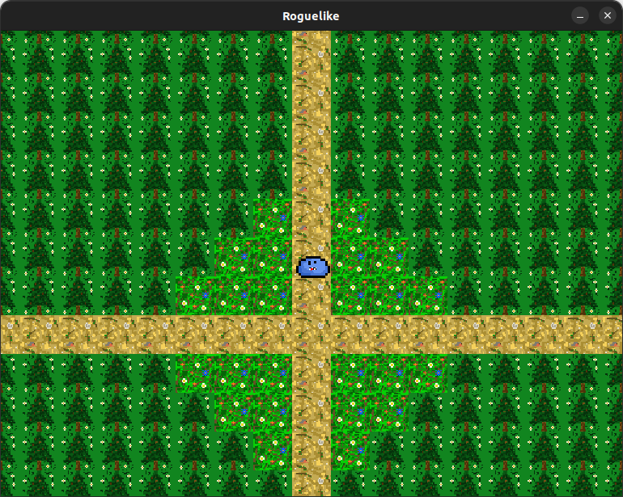
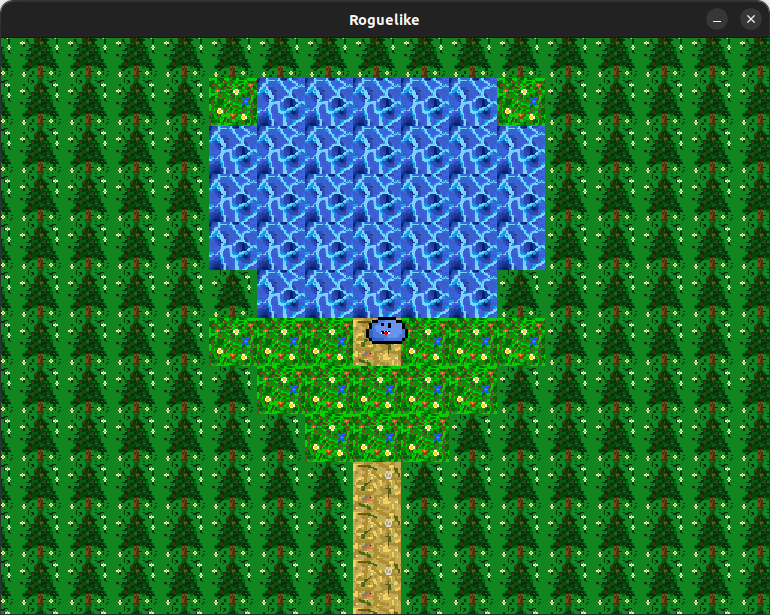
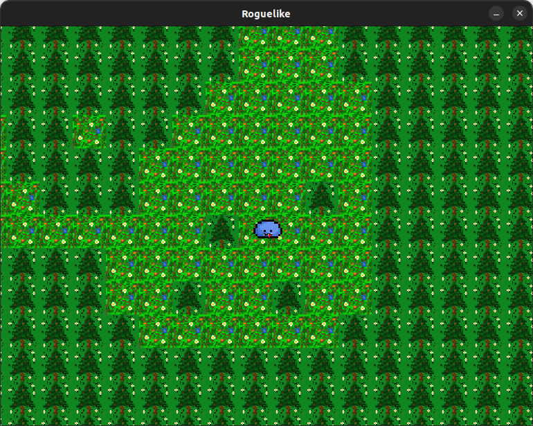

# Rougelike

Игра в жанре roguelike

Ссылка на наш проект: [https://github.com/SofyaLeontyeva/roguelike]

### Привет, друг!
Мы, студенты совместной программы МФТИ и РАНХиГС, делаем учебный проект по основам проектирования ПО.

> И решили поделиться нашими наработками с __МИРОМ__

Это классическая roguelike игра в лучших традициях жанра.

### О чём игра?

Подобно истинным авантюристам, в этой игре вы в поисках приключений, опасностей и проблем отправитесь в таинственный 
мир. Вас ожидает множество интересных схваток с мобами (mob - mobile object), сундуков с сокровищами 
(ну и потерянное время, __так как надо ботать__). Вы пройдете сквозь заросли местных растений, постоянно оглядываясь, 
чтобы не наткнутся на очередного __босса-вертолёта__ (ему ведь безразлично, кто вы, он всё равно пошинкует вас 
лопостями). 

Ну а если без шуток, то проект в разработке. Есть много планов по его развитию.

### О, а как выглядит?






### Что ещё интересного?

* Игра написана на Java 17, с использованием библиотек swing и awt

### Так, а про фичи?

На данный момент в игре присутствуют следующие фичи:
1. Возможность менять управление WASD и стрелочки клавишей =
2. Возможность ставить игру на паузу нажатием клавиши p
3. Общение с персонажами при нажатии клавиши enter
4. Красочная графика

### Требования к сборке:

Сборка проекта производилась с помощью JDK 17 и Maven 3 (версия 3.8.1). 
Для запуска требуется версия Java не ниже 17ой.

### Запуск на своём аппарате:

Для начала надо проверить, установлен ли Maven на вашем компьютере. Для этого введите в терминале 
следующее: 

```Bash
mvn --version
```

Если у вас стоит версия **Apache Maven 3.x.x**, то следующим шагом надо перейти в директорию в которой лежит 
склонированный проект и запустить в ней следующие команды:

```Bash
# перейти в корневую директорию скачанного вами проекта
cd /path/to/your/project

# соберите проект с помощью Maven
mvn clean package

# перейдите в директорию target, где находится собранный JAR-файл
cd target

# запустите JAR-файл с помощью JRE
java -jar Roguelike-1.0-SNAPSHOT.jar
```

**Attention!** Важно чтобы на вашем компьютере стояла не "headless" версия JDK (так как в ней не 
будет графических библиотек). Чтобы поставить версию JDK вместе с графическими библиотеками пропишите в 
терминале следующее:

```Bash
sudo apt-get install openjdk-17-jdk
```
### Авторы:
> Кистин Илья
>>Telegram: @IlyaKistin

> Софья Леонтьева
>>Telegram: @sofyaleo

> Гранков Георгий
>>Telegram: @georggrankov
